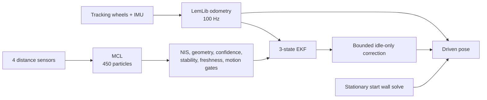

# Localization

Conservative field-aware localization for a PROS V5 differential-drive robot. This
project keeps LemLib odometry and motion control, then adds absolute start
relocalization, MCL range estimation, a 3-state EKF, strict correction gates, and a
robot-to-terminal data collection workflow for hardware tuning.

[Validation report (PDF)](report/localization_report.pdf) | [LaTeX source](report/localization_report.tex) | [Physical validation protocol](validation_data/field_test_protocol.md) | [Reusable tuning prompt](TUNING_AGENT_PROMPT.md)

## Why This Fork Exists

Pure odometry is smooth and repeatable over short distances, but it cannot detect a
bad starting pose or accumulated wheel slip. Distance sensors can provide an
absolute field reference, but bad geometry, game-object occlusion, and symmetric
wall views can make naive fusion less consistent than odometry.

This stack therefore treats odometry as the baseline and range fusion as optional,
gated evidence. If the range estimate is not trustworthy, the driven pose stays on
odometry.



The safety contract is intentional:

- Corrections are suppressed while a chassis motion is active.
- Continuous corrections and motion-boundary re-anchors are bounded.
- Range evidence must pass sensor-count, confidence, covariance, NIS, residual,
  stability, freshness, and pose-delta checks.
- Heading remains IMU-driven; wall ranges do not steer heading.
- A failed or ambiguous sensor view falls back to odometry instead of forcing a fix.
- Fusion gates must not be loosened merely to increase the correction count.

## Evidence And Current Status

The engineering paper in [`report/localization_report.tex`](report/localization_report.tex)
is the detailed source of truth. Its generated report covers seven instrumented
runs and 9,012 trace rows. Seven corrections survived the complete gate stack in
the two useful evidence runs; the other runs remained on odometry when evidence was
weak or blocked. The offline audit independently replayed ray geometry, start wall
solves, correction limits, suppression flags, and odometry sequence continuity.

The report models roughly a 1.8x peak-error reduction from committing already
validated corrections at motion boundaries. That boundary re-anchor and the latest
relocalization cleanup still require the physical tests in
[`validation_data/field_test_protocol.md`](validation_data/field_test_protocol.md)
before they should be described as fully hardware-validated.

## Project Layout

| Path | Purpose |
| --- | --- |
| `src/autonomous_control.cpp` | Autonomous route and active tune-test selector |
| `src/localization_config.cpp` | Field model, sensor geometry, MCL/EKF noise, and fusion gates |
| `src/lemlib/localization/` | MCL, EKF, fusion scheduler, gating, and trace capture |
| `src/lemlib/chassis/odom.cpp` | Odometry integration and delta history |
| `src/localization_tune.cpp` | Tune routes, brain overlay, log capture, and terminal export |
| `src/robot.cpp` | Tracking-wheel geometry and robot hardware configuration |
| `src/tune.txt` | Latest pasted robot export used by the analyzer |
| `tools/localization_tune_analyzer.py` | Offline calibration and diagnostics |
| `validation_data/` | Preserved runs and physical test protocol |
| `report/` | Reproducible LaTeX report, generated plot data, and PDF |

## Build

Requirements:

- PROS CLI and the V5 ARM toolchain
- Python 3 for offline analysis
- `latexmk` plus the LaTeX packages used by the report, only when rebuilding the PDF

From the repository root:

```sh
make quick
```

Use the normal PROS upload flow after a successful build. Upload only when the V5
Brain is connected and the robot is in a safe test area.

## Built-In Test Routes

Select a route with `kLocalizationTuneTest` in
[`src/autonomous_control.cpp`](src/autonomous_control.cpp). Always inspect the source
before a run; the selector changes during iterative tuning.

| Value | Route | Primary use | Test condition |
| ---: | --- | --- | --- |
| `0` | Normal route | End-to-end autonomous validation | Competition start, complete field, repeatable placement |
| `1` | Turn center | Angular PID and center-of-rotation drift | Clear turning footprint, fixed start, robot free to rotate |
| `2` | Straight scale | Forward/reverse scale and lateral drift | Long clear lane, straight wheels, fixed start |
| `3` | Square loop | Translation, turns, and return-home drift | Clear square footprint, repeatable placement |
| `4` | Drive probe | Open-loop drivetrain balance vs. closed-loop motion | Long clear lane, level battery, fixed start |
| `5` | Sensor angle | Distance-sensor mounting angle fit | Stationary turn sweep with clean perimeter-wall views |
| `6` | Square + cross | Oblique motion and full fusion behavior | Largest clear footprint, repeatable placement |

At the time of this README, the checked-in selector is `0`. Do not rely on that
sentence after tuning begins; read the constant.

## Collect A Robot Log

1. Choose one test based on the parameter being identified. Change only the test
   selector unless the current evidence already justifies another code change.
2. Run `make quick`, upload the program, and place the robot under the test condition
   in the table above. Keep start placement, battery state, and field obstacles as
   consistent as practical across comparisons.
3. Connect the V5 Brain to the computer with the programming cable. Keep the cable
   clear of the drivetrain and run the terminal from the repository root.

   On the computer used for this project:

   ```sh
   cd "/Users/ouji/Documents/Localization Test"
   pros terminal
   ```

   On another computer, replace the path with that machine's clone location:

   ```sh
   cd "/path/to/localization"
   pros terminal
   ```

4. Run the selected autonomous test. Wait until the Brain says the run is complete
   and shows `Tap lower-right to dump`.
5. With `pros terminal` still running, tap the lower-right of the Brain screen. The
   terminal prints the complete report between these markers:

   ```text
   === BEGIN LOCALIZATION TUNE LOG ===
   ...
   === END LOCALIZATION TUNE LOG ===
   ```

6. Replace `src/tune.txt` with the complete marked export. Preserve important runs
   separately under `validation_data/` before replacing the latest log.
7. Analyze the export:

   ```sh
   python3 tools/localization_tune_analyzer.py src/tune.txt
   ```

8. Apply only conclusions supported by the log, rebuild, and run the next selected
   test. Sensor geometry normally needs multiple clean Test 5 starts spanning the
   field; a single occluded placement is not enough.

## Agent-Assisted Tuning

Open this repository in Codex or Claude Code, paste the contents of
[`TUNING_AGENT_PROMPT.md`](TUNING_AGENT_PROMPT.md), and say that the newest export is
ready in `src/tune.txt`. The agent prompt instructs the coding agent to:

- inspect the actual active test and log metadata;
- analyze first, then make small evidence-backed changes;
- choose and enable the next useful test automatically;
- build after every source change;
- tell the operator the exact placement, clearance, and repetition conditions;
- avoid requesting manual sensor-position measurements;
- keep fusion at least as consistent as the odometry-only baseline.

Tuning is complete only after repeat hardware runs cover turn, straight, sensor
geometry, and combined routes; changes improve holdout logs rather than only the
fitting log; and strict fusion does not degrade the odometry-only baseline.

## Reproduce The Report

The analysis scripts regenerate the report data from the preserved validation logs:

```sh
python3 tools/drift_analysis.py
python3 tools/audit_analysis.py
cd report
latexmk -pdf localization_report.tex
```

## License

This repository includes and modifies LemLib under the MIT License. See
[`LICENSE`](LICENSE).
