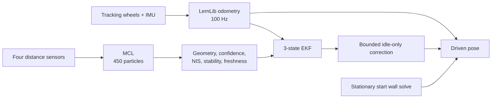

<h1 align="center">VEX V5 Robotics Localization</h1>

<p align="center">
  Conservative field-aware localization for VEX V5 robots using PROS, combining LemLib odometry,
  Monte Carlo Localization, and an Extended Kalman Filter without sacrificing a stable
  odometry-only fallback.
</p>

<p align="center">
  
  
  
  <a href="https://github.com/NlGanma/localization/actions/workflows/pros-build.yml"></a>
  <a href="LICENSE"></a>
</p>

<p align="center">
  <a href="report/localization_report.pdf"><strong>Technical Report</strong></a>
  &nbsp;&middot;&nbsp;
  <a href="validation_data/field_test_protocol.md">Field Test Protocol</a>
  &nbsp;&middot;&nbsp;
  <a href="TUNING_AGENT_PROMPT.md">Agent Tuning Workflow</a>
</p>

> [!IMPORTANT]
> This project is in active hardware validation. Range corrections are deliberately
> conservative: when sensor evidence is weak, blocked, stale, or ambiguous, the
> driven pose remains on odometry.

## Overview

Stock odometry is smooth and predictable, but it cannot detect an incorrect starting
pose or accumulated wheel slip. Distance sensors provide an absolute field reference,
but careless fusion can make the robot less consistent than odometry alone.

This project treats odometry as the baseline and localization as gated evidence:

- **LemLib odometry** integrates tracking-wheel and IMU deltas at 100 Hz.
- **MCL** estimates absolute field pose from four distance sensors.
- **EKF** propagates odometry uncertainty and evaluates MCL measurements.
- **Start relocalization** anchors the autonomous frame while the robot is stationary.
- **Strict fusion gates** reject implausible, unstable, or poorly observed corrections.
- **Boundary re-anchors** apply trusted corrections only while the chassis is idle.
- **Deep-dive telemetry** exports every relevant pose, sensor, covariance, and gate state.
- **Reusable PTO control** switches shared motors safely between 4-motor mechanisms
  and an 8-motor drivetrain.



## Validation Snapshot

The published [technical report](report/localization_report.pdf) summarizes seven
instrumented field runs and an independent offline audit.

| Evidence | Result |
| --- | ---: |
| Recorded localization trace rows | 9,012 |
| Instrumented field runs | 7 |
| Corrections surviving the complete gate stack | 7 |
| Modeled peak-error improvement from boundary re-anchor | 1.8x |
| Corrections accepted during active chassis motion | 0 |

The 1.8x result is a replay of already-validated fixes at motion boundaries, not a
final measured hardware claim. The boundary re-anchor and latest relocalization
cleanup must still pass the physical protocol before the stack is considered fully
tuned.

## Safety Contract

The localization layer is designed to be no worse than the odometry baseline:

- Corrections are suppressed while a chassis motion is active.
- Continuous corrections and motion-boundary re-anchors are bounded.
- Evidence must pass sensor-count, confidence, covariance, NIS, residual, stability,
  freshness, and pose-delta checks.
- Wall ranges solve position only; heading remains IMU-driven.
- Ambiguous or blocked views fall back to odometry instead of forcing a field fix.
- Fusion thresholds are not loosened merely to increase the correction count.

## Reusable PTO Switching

The robot control layer also contains PTO switching logic that other VEX V5 teams
can adapt when motors serve both drivetrain and mechanism roles. The implementation
includes:

- motion-aware shift windows that avoid changing PTO state during a chassis motion;
- controlled creep and delay timing to unload the transmission before engagement;
- automatic mirroring of teleop drive output to PTO motors in 8-motor mode;
- separate 4-motor and 8-motor controller-gain profiles;
- explicit released-motor role mapping for intake and roller behavior;
- blocking and non-blocking shift helpers, safe stops, and position-hold handling.

The reusable architecture is in [`src/robot_control.cpp`](src/robot_control.cpp),
[`include/robot_control.hpp`](include/robot_control.hpp), and the PTO extensions to
the LemLib chassis. Motor ports, command signs, piston values, shift timing, and
controller gains are robot-specific and must be validated before another team uses
them on hardware.

## Quick Start

### Requirements

- PROS CLI and the V5 ARM toolchain
- Python 3 for offline analysis
- A V5 Brain and programming cable for hardware logging

### Build

```sh
git clone https://github.com/NlGanma/localization.git
cd localization
make quick
```

Use the normal PROS upload flow only after the build succeeds and the robot is in a
safe test area.

## Built-In Test Routes

Select a route with `kLocalizationTuneTest` in
[`src/autonomous_control.cpp`](src/autonomous_control.cpp). Inspect the source before
each run because the selector changes throughout iterative tuning.

| Value | Route | Primary use | Required condition |
| ---: | --- | --- | --- |
| `0` | Normal route | End-to-end autonomous validation | Competition start and complete field |
| `1` | Turn center | Angular PID, turn scale, center drift | Clear turning footprint and fixed start |
| `2` | Straight scale | Forward/reverse scale and lateral drift | Long clear lane and fixed start |
| `3` | Square loop | Translation, turns, return-home drift | Clear square footprint |
| `4` | Drive probe | Open-loop drivetrain balance | Long clear lane and consistent battery state |
| `5` | Sensor angle | Distance-sensor geometry | Clean perimeter-wall views at multiple placements |
| `6` | Square + cross | Oblique motion and full fusion | Largest clear footprint and fixed start |

The checked-in selector is currently `0`. The source constant remains authoritative.

## Collect A Robot Log

1. Select the test that isolates the parameter under investigation.
2. Run `make quick`, upload, and place the robot under the test condition above.
3. Connect the V5 Brain to the computer with the programming cable.
4. Open a terminal in the clone and start the PROS terminal:

   ```sh
   cd "/path/to/localization"
   pros terminal
   ```

   The original development-machine path is:

   ```sh
   cd "/Users/ouji/Documents/Localization Test"
   pros terminal
   ```

5. Run autonomous and wait for `Tap lower-right to dump` on the Brain.
6. Keep the terminal open and tap the lower-right of the Brain screen.
7. Capture the complete block:

   ```text
   === BEGIN LOCALIZATION TUNE LOG ===
   ...
   === END LOCALIZATION TUNE LOG ===
   ```

8. Put the newest export in `src/tune.txt`, preserving important prior runs under
   `validation_data/`.
9. Analyze it:

   ```sh
   python3 tools/localization_tune_analyzer.py src/tune.txt
   ```

Apply only conclusions supported by the log. Sensor geometry normally requires
multiple clean Test 5 placements spanning the field; a single occluded sweep is not
enough.

## Agent-Assisted Tuning

For an iterative Codex or Claude Code workflow:

1. Put the newest complete export in `src/tune.txt`.
2. Open the repository in the coding agent.
3. Paste [`TUNING_AGENT_PROMPT.md`](TUNING_AGENT_PROMPT.md).
4. Say `data ready` after each new robot export.

The prompt requires the agent to analyze before editing, select and enable the next
useful test, build every C++ change, specify exact physical test conditions, avoid
manual sensor-position measurements, and preserve strict fusion gates.

## Repository Map

| Path | Purpose |
| --- | --- |
| `src/autonomous_control.cpp` | Autonomous route and tune-test selector |
| `src/localization_config.cpp` | Field model, sensor geometry, MCL/EKF noise, fusion gates |
| `src/lemlib/localization/` | MCL, EKF, correction scheduling, and trace capture |
| `src/lemlib/chassis/odom.cpp` | Odometry integration and delta history |
| `src/localization_tune.cpp` | Tune routes, Brain overlay, log capture, terminal export |
| `src/robot.cpp` | Tracking-wheel geometry and robot hardware configuration |
| `src/robot_control.cpp` | PTO switching, shared-motor roles, intake, and mechanism control |
| `tools/localization_tune_analyzer.py` | Offline calibration and diagnostics |
| `validation_data/` | Preserved runs and physical validation protocol |
| `report/localization_report.pdf` | Published engineering and validation report |

## License

This repository includes and modifies LemLib under the [MIT License](LICENSE).
